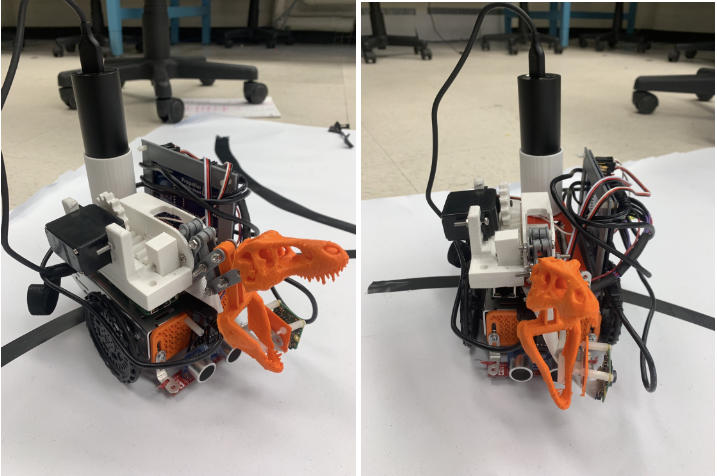
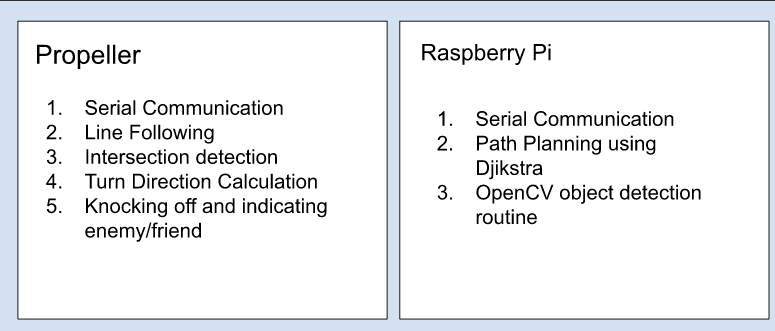

# Autonomous Delivery Robot
An Autonomous delivery robot that navigates in a grid map using Djikstra's algorithm for path planning. THe robot also has an on-board real-time camera detection system that detects enemies/friendlies and takes appropriate action. 

The path planning and perception system runs on a raspberry pi and instructions are sent over UART communication to a multi-core microcontroller, that performs line following, object detection and motion of the robot.

Since a major part of the project was to use two devices together we decided to break our solution into two halves and assign each device to perform a specific task. The following is how we broke down the solution.

